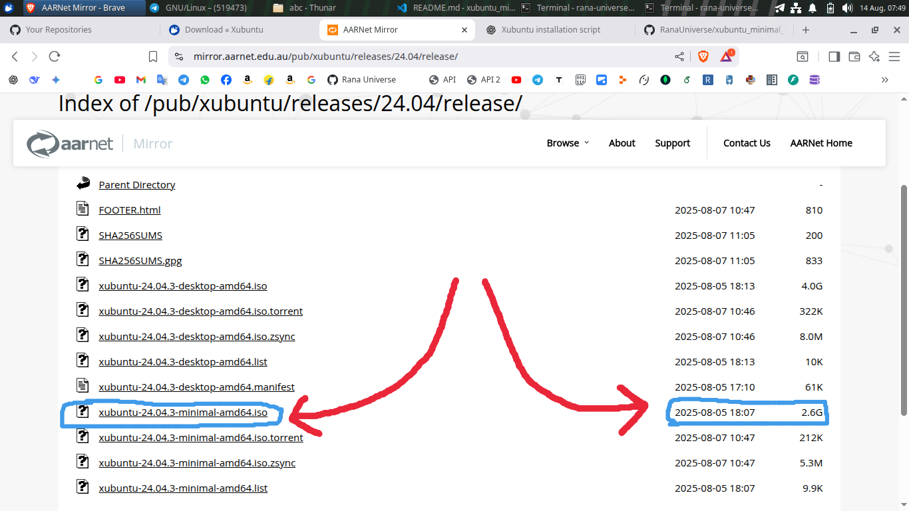

# 🖥️ Xubuntu Minimal Installation  

This repository is for making the **Xubuntu Desktop OS** a **good, usable** system 💻 — equipped with most essential apps and configurations, installed **automatically** through an installation script.  

---

## 📌 OS Version  

Currently, this repo is tested and works with:  

```
Xubuntu 24.04.3 LTS ISO
```

> 🕒 **Note:** From **13 August 2025**, I noticed **24.04.3 LTS** was released — so I decided to use the **new version** from now on. 🚀  

This is from where i downloded the Iso File for this. I keep this in my Pendrive as a Backup and also use this, iso file.
Download Page LInk: https://xubuntu.org/download/

Then i selected Any Country Server and got select the minimal iso file.

Example for[ Australia Server ]([url](https://mirror.aarnet.edu.au/pub/xubuntu/releases/24.04/release/))the below is shows.





## what to do after use this repo?
"🔗 https://github.com/RanaUniverse/xubuntu_config_settings"

I need to use this repo for my basic config settings.

---

## 🛠️ How To Use This


1. Run the installation script:  
   ```bash
   ./installation_script.sh
   ```

It will automatically install the all necessary things, and some configuration settings.

---

## 📥 How I Get the Packages & Dependencies  

Since I want this to work **offline**, I download all required `.deb` files first. Then I can install them without internet.  

> 📄 **Full Guide:**  
> [📎 See the full documentation here](./files_and_folders/how_to_get_offline_packages.md)  

---

✅ With this setup, you’ll have a **minimal Xubuntu** that’s already equipped with the essential tools, ready to use right after installation. 🎯  


```
## 🔐 GPG Key Setup for Git Commit & Verification

For Gpg Key verificaion i need to follow the things below:


The GPG KEY Setup is here.

git config --global user.name "RanaUniverse"
git config --global user.email "RanaUniverse321@gmail.com"
gpg --list-secret-keys --keyid-format=long
gpg --full-generate-key

gpg --list-secret-keys --keyid-format=long


sec   rsa2016/ABC123XYZ789RANA 2024-10-26 [SC] [expires: 2024-11-10]
      987XYZ123ABCRANA123ABC78ABC123XYZ789RANA
uid                 [ultimate] RanaUniverse ("GPG key making for testing for github") <RanaUniverse321@gmail.com>
ssb   rsa2016/XYZ123ZYX987RANA 2024-10-26 [E] [expires: 2024-11-10]

gpg --armor --export ABC123XYZ789RANA
git config --global user.signingkey ABC123XYZ789RANA
git config --global commit.gpgsign true
```


